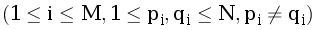
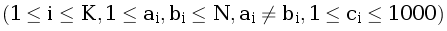
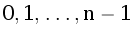

F. Стоимость дорог
==================

Ограничение времени

0.5 секунд

Ограничение памяти

32Mb

Ввод

стандартный ввод или input.txt

Вывод

стандартный вывод или output.txt

Энрике Мартинес — новый мэр недавно построенного города Нуэва-Сьюдад. В этом городе есть N зданий, пронумерованных от 1 до N. Мартинес живёт в здании под номером X, а в здании под номером Y находится мэрия. Сейчас в Нуэва-Сьюдаде есть M дорог с двусторонним движением, каждая дорога соединяет ровно два здания. Для улучшения транспортной ситуации в городе можно построить ещё K таких дорог. Мэр знает, сколько денег нужно потратить на строительство каждой из них, но не знает, можно ли из его дома добраться до мэрии по существующим дорогам. Он приказал построить некоторое количество дорог так, чтобы, во-первых, из его дома можно было добраться до мэрии и, во-вторых, потратить на это минимально возможную сумму (в казне города пока ещё не так много денег). Помогите мэру Нуэва-Сьюдада узнать стоимость нужных дорог.

Формат ввода
------------

В первой строке записаны два целых числа, разделённых пробелом, — N (1 ≤ N ≤ 105) — количество зданий в Нуэва-Сьюдаде и M (0 ≤ M ≤ 105) — количество построенных дорог.  
В следующих M строках записаны M пар целых чисел pi и qi , — номера зданий, между которыми есть дорога.  
В следующей строке записано целое неотрицательное число K (0 ≤ K ≤ 105) — количество запланированных дорог.  
В следующих K строках записано K троек целых чисел ai, bi и ci , — номера зданий, между которыми возможно построить дорогу, и сумма, за которую эта дорога может быть построена. В последней строке записано 2 целых числа X и Y (1 ≤ X, Y ≤ N). Гарантируется, что N + M ≤ 105.

Формат вывода
-------------

Вычислите минимально возможную сумму, которую нужно будет потратить мэру для того, чтобы существовал путь из X в Y. Если же обеспечить существование этого пути невозможно, то ответом будет число -1. Вы не должны ничего выводить (см. примечания).

### Пример 1

##### Ввод

```
4 2
1 2
3 4
1
2 3 1
1 4
```

##### Вывод

```
1
```

### Пример 2

##### Ввод

```
4 1
2 1
3
1 3 1
4 3 1
2 4 3
1 4
```

##### Вывод

```
2
```

Примечания
----------

В этой задаче вы должны прислать заголовочный файл, содержащий определение класса Heap и функцию для решения задачи, его использующую. Функция должна считывать данные из стандартного потока ввода и возвращать ответ на задачу. Используйте следующий прототип:

int calculate\_min\_cost();

Ваша min-куча должна оперировать значениями типа int. Значения в куче задаются в конструкторе (разными способами, подробное описание ниже), и новые значения к ним более добавляться не будут, т.е. размер кучи не увеличивается в процессе выполнения (но может уменьшаться). Всем n входным значениям в соответствие ставятся ключи, которые задаются числами  в порядке подачи значений в конструкторе. Именно с помощью этих ключей в дальнейшем производится операция decreaseKey. Ключи должны быть типа size\_t.

Реализация класса Heap должна включать:

1.  Конструктор, принимающий размер кучи и значение всех элементов в куче, которое по умолчанию равно 0.
2.  Конструктор, принимающий итераторы на начало и следующий за концом последовательности значений.
3.  Конструктор, принимающий std::initializer\_list<int>.
4.  Константный метод empty, возвращающий true, если куча пуста и false в противном случае.
5.  Константный метод size, возвращающий размер кучи.
6.  Константный метод top, который возвращает ключ минимума кучи.
7.  Метод pop, который удаляет минимум из кучи.
8.  Метод decrease\_key, принимающий ключ и новое значение и устанавливающий элементу с заданным ключом новое значение. Следить за тем, чтобы новое значение было меньше предыдущего, должен сам пользователь класса, поэтому поведение класса при несоблюдении этого требования может быть любым.

Обратите внимание, что тестирующая программа достаточно строго проверяет требования из условия. В случае их несоблюдения (или при наличии ошибок в реализации) вы будете получать вердикт Compile Error или Runtime Error на 1 тесте.