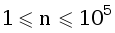
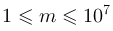
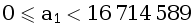
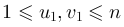
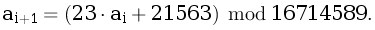
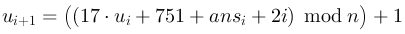
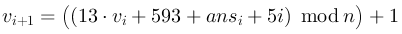

A. Разреженные таблицы
======================

Ограничение времени

2 секунды

Ограничение памяти

64Mb

Ввод

стандартный ввод или sparse.in

Вывод

стандартный вывод или sparse.out

Дан массив из n чисел. Требуется написать программу, которая будет отвечать на запросы следующего вида: найти минимум на отрезке между u и v включительно.

Формат ввода
------------

В первой строке входного файла даны три натуральных числа n, m (, ) и a1 () — количество элементов в массиве, количество запросов и первый элемент массива соответственно. Вторая строка содержит два натуральных числа u1 и v1 () — первый запрос.

Элементы a2, a3, …, an задаются следующей формулой:



Например, при n = 10, a1 = 12345 получается следующий массив: a = (12345, 305498, 7048017, 11694653, 1565158, 2591019, 9471233, 570265, 13137658, 1325095).

Запросы генерируются следующим образом:

,  
,

где ansi — ответ на запрос номер i.

Обратите внимание, что ui может быть больше, чем vi.

Формат вывода
-------------

В выходной файл выведите um, vm и ansm (последний запрос и ответ на него).

Пример
------

##### Ввод

```
10 8 12345
3 9
```

##### Вывод

```
5 3 1565158
```