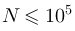
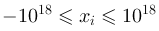

A. Сортировка чисел
===================

Ограничение времени

1 секунда

Ограничение памяти

64Mb

Ввод

стандартный ввод или input.txt

Вывод

стандартный вывод или output.txt

Вам требуется отсортировать целые числа по возрастанию квадрата расстояния от некоторого фиксированного числа (при равенстве меньшее число идет раньше).

Формат ввода
------------

В первой строке записано одно целое число x, .

Во второй строке записано N целых чисел xi, , 

Формат вывода
-------------

Выведите числа xi, отсортированные в порядке возрастания (xi - x)2 , при равенстве раньше идет меньшее.

Пример
------

##### Ввод

```
2
1 2 3 4 5
```

##### Вывод

```
2
1
3
4
5
```