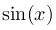

J. Интеграл
===========

Ограничение времени

1 секунда

Ограничение памяти

64Mb

Ввод

стандартный ввод или input.txt

Вывод

стандартный вывод или output.txt

Вася изучил два метода приближенного интегрирования функций — метод прямоугольников и метод трапеций. Он даже написал программу, которая будет получать на вход метод интегрирования, концы отрезка и число отрезков разбиения, и будет вычислять интеграл от функций  и : [https://clck.ru/AqncS](https://clck.ru/AqncS).

Напишите недостающие классы IntegrationMethod, RectangleRule и TrapezoidalRule с реализацией методов интегрирования, чтобы Васина программа заработала. В них должна быть реализована функция Integrate, принимающая на вход функцию для интегрирования, концы отрезка (double) и число частей для разбиения (int).

Обратите внимание, что шаблонные функции не могут быть виртуальными, поэтому тип функции интегрирования не получится сделать шаблонным параметром функции Integrate. Вместо этого нужно сделать шаблонным весь класс, и передавать тип функции еще при создании класса. К счастью, последнюю часть Вася уже сделал за вас (см. строки 9, 13, 15, 17).

Пример
------

##### Ввод

```
rectangle 0 3.1415926 100
```

##### Вывод

```
5.3592e-08
2.00008
```

Примечания
----------

Вам нужно сдать только код классов. В вашей программе не должно быть функции main: мы будем тестировать ваш код с Васиной функцией main.

Формулы интегрирования такие:


где .